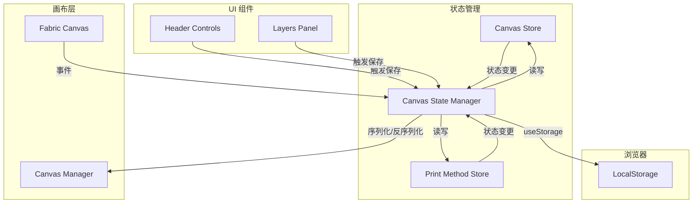

# 设计文档：画布状态持久化

## 概述

本设计文档描述了 PW Canvas 画布状态持久化功能的技术实现方案。该功能使用 VueUse 的 `useStorage` API 将画布状态保存到浏览器 LocalStorage，实现页面刷新后自动恢复画布对象、图层、图层组和印刷方式绑定。

### 设计目标

1. 无缝集成现有的 Pinia Store 架构
2. 利用已有的 VueUse useStorage 基础设施
3. 最小化对现有代码的侵入性修改
4. 提供可靠的状态序列化和反序列化机制

## 架构



### 数据流

1. **保存流程**: Canvas 事件 → Canvas State Manager → 序列化 → LocalStorage
2. **恢复流程**: 页面加载 → Canvas State Manager → LocalStorage → 反序列化 → Stores/Canvas

## 组件和接口

### Canvas State Manager（新增模块）

```javascript
// public/js/design/utils/canvas-state-manager.js

/**
 * 画布状态管理器
 * 负责画布状态的持久化和恢复
 */
class CanvasStateManager {
    constructor() {
        this.productId = null;
        this.storage = null;
        this.saveDebounceTimer = null;
        this.SAVE_DEBOUNCE_MS = 300;
    }
    
    /**
     * 初始化状态管理器
     * @param {string} productId - 产品ID
     */
    init(productId) {}
    
    /**
     * 保存当前视图的画布状态
     * @param {string} viewId - 视图ID
     */
    saveViewState(viewId) {}
    
    /**
     * 恢复指定视图的画布状态
     * @param {string} viewId - 视图ID
     * @returns {boolean} 是否成功恢复
     */
    restoreViewState(viewId) {}
    
    /**
     * 保存所有视图的状态
     */
    saveAllViewStates() {}
    
    /**
     * 清除指定产品的所有状态
     * @param {string} productId - 产品ID（可选，默认当前产品）
     */
    clearProductState(productId) {}
    
    /**
     * 清除指定视图的状态
     * @param {string} viewId - 视图ID
     */
    clearViewState(viewId) {}
    
    /**
     * 获取存储键名
     * @param {string} productId - 产品ID
     * @returns {string} 存储键名
     */
    getStorageKey(productId) {}
}
```

### 状态数据结构

```typescript
interface PersistedCanvasState {
    version: string;                    // 数据版本号，用于迁移
    productId: string;                  // 产品ID
    lastModified: number;               // 最后修改时间戳
    views: {
        [viewId: string]: ViewState;
    };
    selectedColorsByView: {
        [viewId: string]: ColorSelection;
    };
}

interface ViewState {
    canvasJSON: object;                 // Fabric.js toJSON() 输出
    layers: LayerData[];                // 图层元数据
    layerGroups: LayerGroupData[];      // 图层组数据
    layerPrintMethodMap: {              // 图层-印刷方式映射
        [layerId: string]: string;
    };
    groupPrintMethodMap: {              // 图层组-印刷方式映射
        [groupId: string]: string;
    };
}

interface LayerData {
    id: string;
    type: string;
    name: string;
    locked: boolean;
    groupId: string | null;
}

interface LayerGroupData {
    id: string;
    name: string;
    expanded: boolean;
    locked: boolean;
    selectOnly: boolean;
}

interface ColorSelection {
    // 完整的变体对象，包含API返回的所有字段
    [key: string]: any;
}
```

### Store 扩展

#### Canvas Store 扩展

```javascript
// 在 public/js/design/stores/index.js 中添加

// State 扩展
state: () => ({
    // ... 现有状态
    isRestoringState: false,  // 标记是否正在恢复状态，防止循环保存
}),

// Actions 扩展
actions: {
    // ... 现有方法
    
    setRestoringState(value) {
        this.isRestoringState = value;
    },
    
    // 批量设置视图数据（用于状态恢复）
    restoreViewData(viewId, { layers, layerGroups }) {
        this.viewLayers[viewId] = layers;
        this.viewLayerGroups[viewId] = layerGroups;
        if (viewId === this.activeViewId) {
            this.layers = layers;
            this.layerGroups = layerGroups;
        }
    },
}
```

#### Print Method Store 扩展

```javascript
// 在 public/js/design/stores/printMethodStore.js 中添加

actions: {
    // ... 现有方法
    
    // 批量恢复印刷方式映射
    restorePrintMethodMappings(viewId, { layerMap, groupMap }) {
        // 恢复图层映射
        Object.entries(layerMap).forEach(([layerId, methodId]) => {
            this.layerPrintMethodMap[layerId] = methodId;
        });
        
        // 恢复图层组映射
        Object.entries(groupMap).forEach(([groupId, methodId]) => {
            this.groupPrintMethodMap[groupId] = methodId;
        });
        
        // 重新计算已使用的印刷方式
        this.recomputeUsedPrintMethodsForView(viewId);
    },
}
```

## 数据模型

### LocalStorage 键名格式

```
pwca-canvas-state-{productId}
```

示例: `pwca-canvas-state-12345`

### 数据版本控制

```javascript
const CURRENT_VERSION = '1.0.0';

// 版本迁移函数
function migrateState(state) {
    if (!state.version) {
        // 从无版本迁移到 1.0.0
        state.version = '1.0.0';
    }
    return state;
}
```

## 正确性属性

*正确性属性是系统在所有有效执行中应保持为真的特征或行为——本质上是关于系统应该做什么的形式化陈述。属性是人类可读规范和机器可验证正确性保证之间的桥梁。*

### 属性 1：画布状态往返一致性

*对于任何*包含对象、图层、图层组和印刷方式映射的有效画布状态，将状态序列化到 LocalStorage 然后反序列化应产生等价的状态，其中所有对象属性（位置、缩放、旋转、颜色、文本内容）、图层元数据、图层组关联和印刷方式映射都被保留。

**验证需求: 1.3, 1.4, 2.2, 2.4, 3.2, 3.4, 4.2, 5.3, 8.2**

### 属性 2：状态变更触发持久化

*对于任何*画布修改操作（添加/删除/修改对象、图层、图层组或印刷方式分配），Canvas_State_Manager 应在防抖周期（500ms）内更新 LocalStorage，且存储的数据应反映最新状态。

**验证需求: 1.1, 2.3, 3.3, 4.4, 8.3**

### 属性 3：产品和视图隔离

*对于任何*两个不同的产品 ID 或视图 ID，为一个产品/视图保存状态不应影响另一个产品/视图的存储状态，加载状态应只返回与请求的产品/视图匹配的数据。

**验证需求: 5.1, 5.4, 6.1, 6.2, 6.3**

### 属性 4：状态清除功能

*对于任何*存储的画布状态，调用产品或视图的清除方法应立即从 LocalStorage 中删除相应的数据，后续的加载尝试应返回 null/空状态。

**验证需求: 7.1, 7.2, 7.3**

### 属性 5：无效数据错误处理

*对于任何* LocalStorage 中损坏或无效的数据（格式错误的 JSON、缺少必需字段、错误的数据类型），Canvas_State_Manager 应优雅地处理错误，记录适当的错误消息，并初始化空画布而不崩溃。

**验证需求: 1.5**

### 属性 6：已使用印刷方式重新计算

*对于任何*带有印刷方式映射的恢复画布状态，恢复后 Print_Method_Store 的 usedPrintMethodsByView 应准确反映该视图中实际分配给图层或图层组的所有印刷方式。

**验证需求: 4.3**

### 属性 7：视图切换状态保持

*对于任何*视图切换操作，切换前应保存前一个视图的状态，切换回该视图应将其状态恢复到切换前的确切状态。

**验证需求: 5.2**

## 错误处理

### 错误类型和处理策略

| 错误类型 | 处理策略 |
|---------|---------|
| LocalStorage 不可用 | 降级为内存存储，警告用户 |
| JSON 解析失败 | 清除损坏数据，初始化空状态 |
| 数据版本不兼容 | 尝试迁移，失败则清除 |
| 画布恢复失败 | 记录错误，保持空画布 |
| 存储配额超限 | 清除旧数据，提示用户 |

### 错误日志格式

```javascript
console.error('[CanvasStateManager] 错误类型:', errorType, '详情:', details);
```

## 实现注意事项

### 防抖保存

为避免频繁写入 LocalStorage，使用 300ms 防抖：

```javascript
saveViewState(viewId) {
    if (this.saveDebounceTimer) {
        clearTimeout(this.saveDebounceTimer);
    }
    this.saveDebounceTimer = setTimeout(() => {
        this._doSaveViewState(viewId);
    }, this.SAVE_DEBOUNCE_MS);
}
```

### 恢复状态标记

恢复状态时设置标记，防止触发循环保存：

```javascript
async restoreViewState(viewId) {
    const store = window.useCanvasStore();
    store.setRestoringState(true);
    try {
        // 恢复逻辑...
    } finally {
        store.setRestoringState(false);
    }
}
```

### 图片恢复

Fabric.js 图片对象需要特殊处理，确保图片元素正确加载：

```javascript
// 恢复图片时使用 fabric.util.enlivenObjects
fabric.util.enlivenObjects(state.objects.objects || [], (objects) => {
    objects.forEach(obj => canvas.add(obj));
    canvas.renderAll();
});
```
