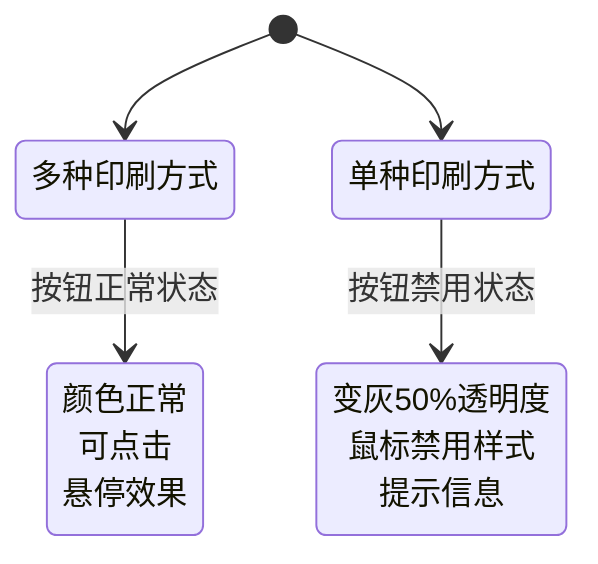

# 图层切换印刷方式按钮禁用功能设计

## 概述

在 PW Canvas 项目的图层面板中，当当前视图的可用印刷方式只有一个时，图层和图层组的"切换印刷方式"按钮应该变灰且不可点击，避免用户进行无意义的操作。

## 需求分析

### 核心需求
- 当 Pinia 中 `currentViewPrintMethods` 数组只有一个元素时
- 图层的"Switch Printing Method"按钮变灰且不可点击  
- 图层组的印刷方式修改按钮变灰且不可点击
- 提供合理的用户提示信息

### 触发条件
- **状态监听**: `printMethodStore.currentViewPrintMethods.length === 1`
- **应用范围**: 
  - 未分组图层的"Switch Printing Method"按钮
  - 分组图层的"Switch Printing Method"按钮
  - 图层组的印刷方式修改按钮（带打印图标的按钮）

## 技术实现方案

### 1. 状态管理增强

#### 在 printMethodStore 中添加计算属性

```javascript
// public/js/design/stores/printMethodStore.js
getters: {
    // 现有的 getters...
    
    // 新增：检查是否只有单个印刷方式
    isSinglePrintMethod: (state) => {
        return state.currentViewPrintMethods.length === 1;
    },
    
    // 新增：检查是否允许切换印刷方式
    canSwitchPrintMethod: (state) => {
        return state.currentViewPrintMethods.length > 1;
    }
}
```

### 2. 图层面板组件修改

#### 添加计算属性和按钮状态控制

```javascript
// public/js/design/components/layers.js - setup() 函数中
const canSwitchPrintMethod = Vue.computed(() => printMethodStore.canSwitchPrintMethod);
const isSinglePrintMethod = Vue.computed(() => printMethodStore.isSinglePrintMethod);

// 生成按钮禁用的提示文本
const getSwitchMethodTooltip = Vue.computed(() => {
    if (isSinglePrintMethod.value) {
        return '当前视图只有一种印刷方式，无法切换';
    }
    return '切换印刷方式';
});
```

#### 模板修改 - 未分组图层按钮

```html
<!-- 未分组图层的切换印刷方式按钮 -->
<div class="layer-actions">
    <button 
        @click.stop="showGroupAssignDialog(layer)" 
        class="assign-btn"
        :class="{ 'disabled': isSinglePrintMethod }"
        :disabled="isSinglePrintMethod"
        :title="getSwitchMethodTooltip"
    >
        <i class="iconfont icon-dayin"></i>Switch Printing Method
    </button>
</div>
```

#### 模板修改 - 分组图层按钮

```html
<!-- 分组图层的切换印刷方式按钮 -->
<div class="layer-actions">
    <button 
        @click.stop="showGroupAssignDialog(layer)" 
        class="assign-btn"
        :class="{ 'disabled': isSinglePrintMethod }"
        :disabled="isSinglePrintMethod"
        :title="getSwitchMethodTooltip"
    >
        <i class="iconfont icon-dayin"></i>Switch Printing Method
    </button>
</div>
```

#### 模板修改 - 图层组印刷方式按钮

```html
<!-- 图层组印刷方式修改按钮 -->
<button 
    @click.stop="showGroupPrintMethodDialog(group)" 
    class="layer-btn pwca-group-print-modal__trigger"
    :class="{ 'disabled': isSinglePrintMethod }"
    :disabled="isSinglePrintMethod"
    :title="isSinglePrintMethod ? '当前视图只有一种印刷方式，无法切换' : '修改图层组印刷方式'"
>
    <i class="iconfont icon-dayin"></i>
</button>
```

### 3. CSS 样式增强

#### 禁用状态样式

```scss
// public/css/layers-panel.scss

.assign-btn {
    // 现有样式保持不变
    
    &.disabled {
        opacity: 0.5;
        cursor: not-allowed;
        background-color: #f5f5f5;
        color: #999;
        border-color: #ddd;
        
        &:hover {
            background-color: #f5f5f5;
            color: #999;
            transform: none;
        }
        
        i {
            color: #999;
        }
    }
}

.layer-btn {
    // 现有样式保持不变
    
    &.disabled {
        opacity: 0.5;
        cursor: not-allowed;
        background-color: #f5f5f5;
        color: #999;
        border-color: #ddd;
        
        &:hover {
            background-color: #f5f5f5;
            color: #999;
            transform: none;
        }
        
        i {
            color: #999;
        }
    }
}
```

### 4. 交互行为优化

#### 防止误操作的方法修改

```javascript
// public/js/design/components/layers.js

// 修改显示图层印刷方式选择对话框的方法
const showGroupAssignDialog = (layer) => {
    // 检查是否只有单个印刷方式
    if (printMethodStore.isSinglePrintMethod) {
        console.warn('当前视图只有一种印刷方式，无法切换');
        return;
    }
    
    selectedLayerForAssign.value = layer;
    const currentMethod = printMethodStore.getLayerPrintMethod(layer.id);
    selectedPrintMethodId.value = currentMethod ? currentMethod.id : printMethodStore.selectedPrintMethodId;
    activeTab.value = 'color';
    showPrintMethodDialog.value = true;
};

// 修改显示图层组印刷方式修改弹窗的方法
const showGroupPrintMethodDialog = (group) => {
    // 检查是否只有单个印刷方式
    if (printMethodStore.isSinglePrintMethod) {
        console.warn('当前视图只有一种印刷方式，无法切换');
        return;
    }
    
    selectedGroupForPrintMethod.value = group;
    
    // 获取图层组当前的印刷方式
    const groupLayers = getGroupLayers(group.id);
    if (groupLayers.length > 0) {
        const firstLayerPrintMethod = printMethodStore.getLayerPrintMethod(groupLayers[0].id);
        selectedGroupPrintMethodId.value = firstLayerPrintMethod ? firstLayerPrintMethod.id : null;
    } else {
        selectedGroupPrintMethodId.value = null;
    }
    
    // 使用 MicroModal 显示弹窗
    if (typeof MicroModal !== 'undefined') {
        MicroModal.show('pwca-group-print-method-modal');
    } else {
        console.error('MicroModal is not available');
    }
};
```

## 用户体验设计

### 视觉反馈



### 提示信息策略

| 按钮类型 | 单印刷方式提示 | 多印刷方式提示 |
|---------|---------------|---------------|
| 图层切换按钮 | "当前视图只有一种印刷方式，无法切换" | "切换印刷方式" |
| 图层组修改按钮 | "当前视图只有一种印刷方式，无法切换" | "修改图层组印刷方式" |

## 代码变更清单

### 需要修改的文件

1. **printMethodStore.js** - 添加新的计算属性
2. **layers.js** - 修改模板和逻辑
3. **layers-panel.scss** - 添加禁用状态样式

### 具体变更点

#### printMethodStore.js
- 添加 `isSinglePrintMethod` 计算属性
- 添加 `canSwitchPrintMethod` 计算属性

#### layers.js
- 在 setup() 中添加响应式计算属性
- 修改三个按钮的模板（添加禁用状态）
- 修改 `showGroupAssignDialog` 方法
- 修改 `showGroupPrintMethodDialog` 方法
- 在 return 中导出新的计算属性

#### layers-panel.scss
- 为 `.assign-btn` 添加 `.disabled` 状态样式
- 为 `.layer-btn` 添加 `.disabled` 状态样式

## 测试验证方案

### 功能测试

1. **单印刷方式场景**
   - 设置视图只有一种印刷方式
   - 验证所有切换按钮变灰且不可点击
   - 验证鼠标悬停显示正确提示

2. **多印刷方式场景**
   - 设置视图有多种印刷方式
   - 验证所有切换按钮正常可用
   - 验证点击能正常打开对话框

3. **视图切换场景**
   - 在单印刷方式视图和多印刷方式视图间切换
   - 验证按钮状态能正确响应变化

### 边界测试

1. **空印刷方式场景** - `currentViewPrintMethods` 为空数组
2. **印刷方式数据加载中** - 异步加载状态
3. **印刷方式切换过程** - 状态变更的瞬间

### 用户体验测试

1. **视觉一致性** - 禁用状态与其他禁用按钮风格一致
2. **交互反馈** - 点击禁用按钮无响应
3. **提示信息** - 鼠标悬停显示有意义的提示

## 实施计划

### 开发阶段
1. **第一阶段** - printMethodStore 增强（0.5天）
2. **第二阶段** - layers.js 逻辑修改（1天）
3. **第三阶段** - 样式开发和优化（0.5天）

### 测试阶段
1. **功能测试** - 各种场景验证（0.5天）
2. **集成测试** - 与现有功能兼容性（0.5天）
3. **用户体验测试** - 交互和视觉验证（0.5天）

## 风险评估

### 技术风险
- **低风险** - 基于现有架构扩展，不涉及核心逻辑修改
- **兼容性** - 新增功能不影响现有印刷方式切换逻辑

### 用户体验风险
- **误解风险** - 用户可能不理解为什么按钮被禁用
- **缓解措施** - 提供清晰的提示信息

## 维护说明

### 代码维护
- 禁用状态逻辑集中在 printMethodStore 中
- 样式通过 SCSS 统一管理
- 遵循现有的防冲突命名规范

### 功能扩展
- 可基于此方案扩展其他条件的按钮禁用逻辑
- 提示信息可支持国际化扩展
- 禁用状态样式可复用到其他组件