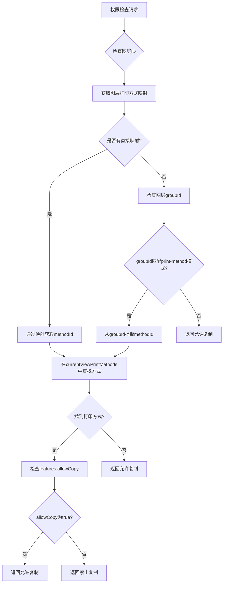
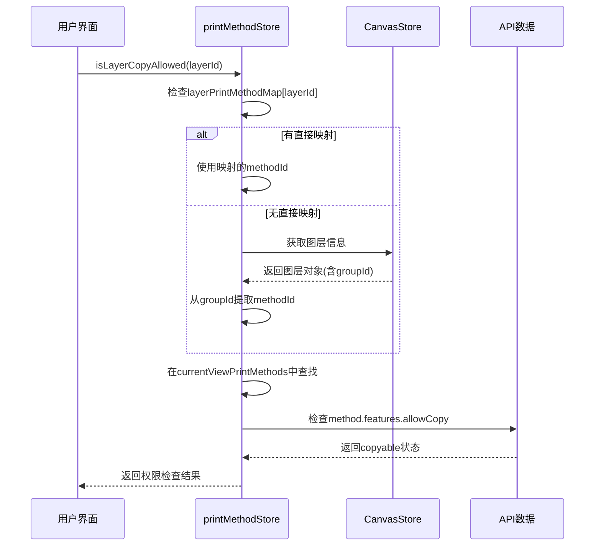
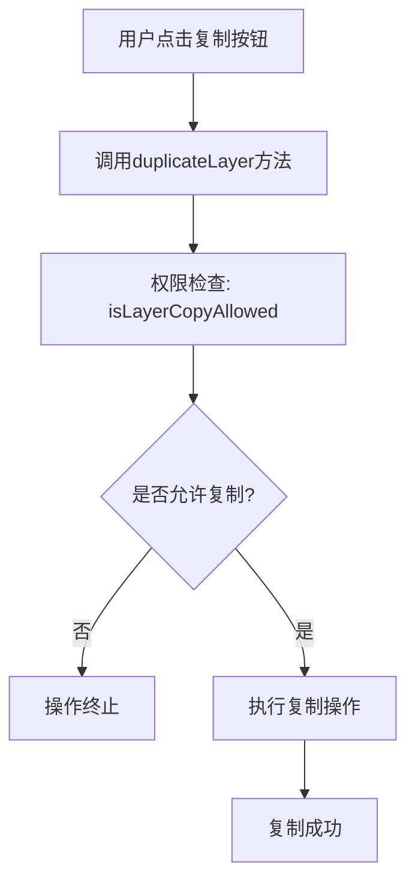

# 打印方式复制限制功能设计

## 概述

在 PW Canvas 系统中，需要实现基于打印方式的图层复制限制功能。当 `currentViewPrintMethods` 中的印刷方式的 `apiData.copyable` 为 `false` 时，属于该打印方式图层组的所有图层都不允许进行复制操作。

## 技术栈

- **前端框架**: Vue 3 + Pinia状态管理
- **图层管理**: Fabric.js 画布系统
- **打印方式管理**: printMethodStore 状态存储
- **图层组织**: 基于groupId的图层分组机制

## 功能分析

### 现有架构

#### 打印方式数据结构
```javascript
// currentViewPrintMethods 数组中的印刷方式对象
{
    id: "method_id",
    name: "印刷方式名称",
    features: {
        allowCopy: apiMethod.copyable,  // 基于API的copyable字段
        allowDelete: true,
        allowMove: true,
        // ...
    },
    // 保留原始API数据
    apiData: {
        copyable: false,  // API原始字段
        // 其他API字段...
    }
}
```

#### 图层组关联机制
- 图层组ID格式: `print-method-{methodId}`
- 图层分配到打印方式组: `layer.groupId = "print-method-{methodId}"`
- 打印方式映射: `layerPrintMethodMap[layerId] = methodId`

### 限制范围

#### 需要限制的操作
1. **图层复制**: UI中的复制按钮功能
2. **图层组复制**: 整个图层组的复制操作

#### 受限对象识别
1. **直接分配的图层**: 通过 `layerPrintMethodMap` 映射关系确定
2. **图层组内图层**: 通过 `groupId` 匹配 `print-method-{methodId}` 模式确定
3. **未分组图层**: 检查是否有直接的打印方式分配

## 架构设计

### 权限检查增强

#### printMethodStore 权限检查方法更新



#### 核心权限检查逻辑增强

```javascript
// 增强的图层复制权限检查
isLayerCopyAllowed: (state) => (layerId) => {
    // 1. 检查直接映射
    let methodId = state.layerPrintMethodMap[layerId];
    
    // 2. 如果没有直接映射，通过图层信息获取groupId
    if (!methodId) {
        const canvasStore = window.useCanvasStore();
        const currentLayers = canvasStore.getViewLayers(canvasStore.activeViewId);
        const layer = currentLayers.find(l => l.id === layerId);
        
        if (layer && layer.groupId) {
            // 从图层组ID推断打印方式ID
            const match = layer.groupId.match(/^print-method-(.+)$/);
            if (match) {
                methodId = match[1];
            }
        }
    }
    
    // 3. 如果仍然没有找到打印方式，默认允许
    if (!methodId) return true;
    
    // 4. 在当前视图的打印方式中查找
    const method = state.currentViewPrintMethods.find(m => m.id === methodId);
    if (!method) return true;
    
    // 5. 检查features.allowCopy（基于apiData.copyable）
    return method.features.allowCopy;
}
```

### 图层组复制权限检查

```javascript
// 图层组复制权限检查（现有逻辑已基本满足需求）
isGroupCopyAllowed: (state) => (groupId) => {
    // 检查直接映射
    let methodId = state.groupPrintMethodMap[groupId];
    
    // 从组ID推断打印方式ID
    if (!methodId) {
        const match = groupId.match(/^print-method-(.+)$/);
        if (match) {
            methodId = match[1];
        }
    }
    
    if (!methodId) return true;
    
    const method = state.currentViewPrintMethods.find(m => m.id === methodId);
    return method ? method.features.allowCopy : true;
}
```

### 用户界面限制实现

#### 图层面板按钮状态控制

```javascript
// layers.js 中的按钮状态绑定
<button 
    @click.stop="duplicateLayer(layer)"
    class="layer-btn copy"
    :class="{ 'disabled': !isLayerCopyAllowed(layer.id) }"
    :disabled="!isLayerCopyAllowed(layer.id)"
    :title="isLayerCopyAllowed(layer.id) ? 'Copy layer' : 'Copy not allowed for this print method'"
>
    <i class="iconfont icon-fuzhi"></i>
</button>
```

#### 复制操作前置检查

```javascript
// 图层复制方法中的权限检查
const duplicateLayer = (layer, targetGroupId = null) => {
    // 权限检查 - 如果不允许复制，直接返回，不执行任何操作
    if (!isLayerCopyAllowed(layer.id)) {
        return;
    }
    
    // 执行复制逻辑...
};
```


## 数据流程

### 权限检查流程



### 用户操作限制流程



## 用户体验设计

### Title提示消息

#### 动态Title内容生成

```javascript
// 动态生成复制按钮的title提示
const getCopyButtonTooltip = (layer) => {
    if (isLayerCopyAllowed(layer.id)) {
        return 'Copy layer';
    }
    
    const printMethod = printMethodStore.getLayerPrintMethod(layer.id) || 
                       printMethodStore.getGroupPrintMethod(layer.groupId);
    
    if (printMethod) {
        return `Copy not allowed - Print method "${printMethod.name}" restricts copying`;
    }
    
    return 'Copy not allowed for this layer';
};
```

### 按钮状态样式

```scss
.layer-btn {
    &.copy {
        &.disabled {
            opacity: 0.4;
            cursor: not-allowed;
            background-color: #f5f5f5;
            
            &:hover {
                background-color: #f5f5f5;
                transform: none;
            }
            
            i {
                color: #ccc;
            }
        }
        
        &:not(.disabled) {
            &:hover {
                background-color: #e3f2fd;
                transform: translateY(-1px);
            }
        }
    }
}
```


## 测试验证策略

### 功能测试用例

#### 基础权限检查测试
1. **直接映射图层**
   - 创建图层并分配copyable=false的打印方式
   - 验证复制按钮为禁用状态
   - 验证按铪title显示限制原因

2. **图层组内图层**
   - 创建打印方式组(copyable=false)
   - 添加图层到该组
   - 验证组内所有图层的复制限制

3. **权限变更测试**
   - 切换图层的打印方式(从允许到禁止)
   - 验证UI状态实时更新

#### 边界条件测试
1. **无打印方式图层**: 验证默认允许复制
2. **打印方式数据缺失**: 验证错误处理
3. **API数据不一致**: 验证fallback机制

### 性能测试考虑
1. **大量图层场景**: 验证权限检查性能
2. **频繁权限查询**: 考虑缓存机制
3. **视图切换性能**: 验证打印方式数据同步效率

## 兼容性考虑

### 现有功能影响评估
1. **图层复制逻辑**: 完全向后兼容
2. **图层组管理**: 不影响现有分组机制
3. **打印方式切换**: 权限状态实时同步

### API数据兼容性
1. **copyable字段缺失**: 默认为true
2. **旧版本打印方式数据**: 向后兼容处理
3. **features.allowCopy字段**: 与apiData.copyable保持同步

### 浏览器兼容性
1. **现代浏览器**: 全功能支持
2. **旧版浏览器**: 基础功能保障
3. **移动端**: 触摸操作适配

## 实施计划

### 开发阶段划分

#### 阶段1: 权限检查核心逻辑 (2天)
- 增强printMethodStore权限检查方法
- 实现图层与打印方式关联检查
- 添加图层组权限检查逻辑

#### 阶段2: 用户界面限制实现 (2天)  
- 更新图层面板按钮状态控制
- 实现复制操作前置检查
- 优化按铪title提示信息

#### 阶段3: 用户体验优化 (1天)
- 完善错误提示消息
- 优化视觉反馈效果
- 实现Tooltip增强提示

#### 阶段4: 测试与优化 (1天)
- 功能测试验证
- 性能优化调整
- 兼容性测试确认

### 风险控制
1. **功能回退**: 保持现有复制功能作为fallback
2. **性能监控**: 监测权限检查对系统性能的影响  
3. **用户反馈**: 收集用户对限制提示的体验反馈

## 维护与扩展

### 代码维护性
1. **权限检查逻辑集中**: 统一在printMethodStore中管理
2. **配置化限制规则**: 支持未来扩展其他操作限制
3. **清晰的错误处理**: 便于问题定位和解决

### 功能扩展性  
1. **其他操作限制**: 可扩展删除、移动等操作限制
2. **自定义限制规则**: 支持基于用户角色的限制
3. **批量操作限制**: 支持批量选择时的权限检查

### 监控与日志
1. **权限检查日志**: 记录限制操作的触发情况
2. **用户行为统计**: 分析用户对限制功能的使用模式
3. **性能监控**: 监测权限检查的执行效率