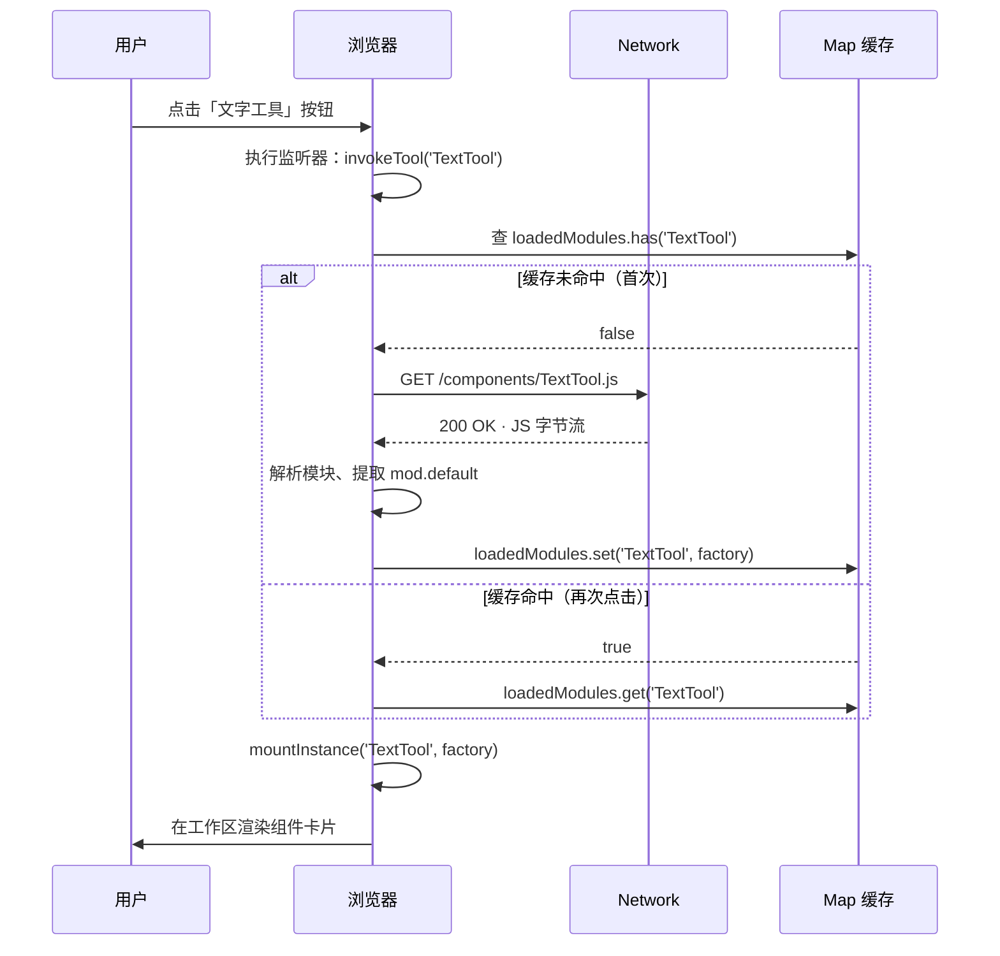

# 微应用按需加载演示 · 原理说明

> 通过动态 `import()` 实现的"用时才下载"的微前端模式演示。
> 配套代码在同目录 `index.html` / `main.js` / `components/*.js` 中。

---

## 1. 这到底是什么

把一个完整应用拆成多个**独立可发布的模块**（这里叫"微应用"），用户在浏览时**只下载他真正用到的部分**。这个目录演示的就是其中最核心的一环：**用 ES Module 动态 import 把"加载"动作延后到用户点击的瞬间**。

常见场景：

- 在线设计器：文字 / 图片 / 水印 / 印刷区各自打包，按工具点击加载
- 后台编辑器：富文本、表格、公式、图表等插件按需启用
- 大型 SPA 的二级页面：路由切换时再下载对应 chunk

---

## 2. 核心原理（30 秒版）

```js
// 静态 import：模块图构建阶段就下载（页面打开时）
import TextTool from './components/TextTool.js';

// 动态 import：返回一个 Promise，调用时才发起请求
const TextTool = (await import('./components/TextTool.js')).default;
```

| 维度 | 静态 `import` | 动态 `import()` |
|---|---|---|
| 执行时机 | 解析阶段（HTML 解析到 `<script>` 时） | 调用函数时 |
| 是否阻塞首屏 | 是 | 否 |
| 是否进入入口 chunk | 是 | 否（独立 chunk） |
| 是否可条件加载 | 否 | 是 |
| 浏览器支持 | ES2015 起 | ES2020 起，主流浏览器均已支持 |

动态 `import()` 的本质是告诉浏览器：

> "我后面会需要这个模块，但**不要现在**就下载。等我执行到这里时再发请求，并把解析后的模块对象（包含 `default`、`*` 等命名导出）通过 Promise 给我。"

---

## 3. 文件结构

```
microapp/
├── index.html                  # 入口 HTML，<script type="module" src="./main.js">
├── main.js                     # 入口模块：注册按钮 + 动态 import + 缓存 Map
├── styles/main.css             # 演示 UI 样式
└── components/
    ├── TextTool.js             # 微应用 1：文字工具
    ├── WatermarkTool.js        # 微应用 2：水印工具
    └── PrintAreaTool.js        # 微应用 3：印刷区工具
```

每个 `components/*.js` 都是**一个独立模块**，用 `export default factory(mount, ctx)` 的形式对外暴露工厂函数。模块之间不互相引用，由 `main.js` 统一调度。

---

## 4. 工作流程（一次完整的点击事件）



要点：

1. **首次点击**才会真的发请求；浏览器只下载那一个文件，不会下载别的。
2. **第二次点击**走 `Map.get(...)`，**0 个新请求**（用 Playwright 抓包可验证）。
3. 工厂函数是**无状态**的，**每次点击都会创建一份新的实例 state**（每个组件卡片里 `state` 是闭包内的局部变量，互不影响）。

---

## 5. 关键代码拆解

### 5.1 入口 main.js 的 loader 声明

```js
// 每个 loader 是一个箭头函数，**包裹** import() 调用
// 这样能保留"调用时才执行"的能力
const loadTextTool     = () => import('./components/TextTool.js');
const loadWatermarkTool= () => import('./components/WatermarkTool.js');
const loadPrintAreaTool= () => import('./components/PrintAreaTool.js');
```

⚠️ 不能写成 `const TextTool = import(...)` —— 顶层 `import()` 会被立即执行，等同于静态 import。

### 5.2 缓存 Map + 实例计数

```js
const state = {
  loadedModules: new Map(),   // name -> factory（模块级单例）
  instances: new Map(),       // name -> { count }（点击几次）
};

const invokeTool = async (name) => {
  let factory = state.loadedModules.get(name);
  if (!factory) {
    const mod = await loaders[name]();
    factory = mod.default;
    state.loadedModules.set(name, factory);   // 首次加载后写入缓存
  }
  mountInstance(name, factory);               // 每次都创建新实例
};
```

缓存的是**工厂函数**，不是实例；实例每次都是新的，所以可以同时挂载多个 TextTool 而互不干扰。

### 5.3 组件的标准写法

```js
// components/TextTool.js
export default function createTextTool(mount, ctx) {
  // mount: 挂载节点（DOM 元素）
  // ctx:   { id, name }  调用方传入的上下文

  const state = { text: 'Hello', size: 40, color: '#7c5cff' };

  mount.innerHTML = `...`;          // 1. 渲染模板
  bindEvents();                      // 2. 绑定事件
  injectStyleOnce();                 // 3. 注入一次性局部样式
  render();                          // 4. 首次渲染
}
```

四个动作是约定的"微应用模板"：模板 → 事件 → 样式 → 渲染。每个文件都可以独立阅读、独立运行（只要给它一个挂载点）。

---

## 6. 浏览器底层到底发生了什么

当你写下 `import('./components/TextTool.js')` 时，浏览器内部会经历：

1. **解析 URL**：根据当前 document base 解析相对路径，得到绝对 URL。
2. **查 HTTP 缓存**：命中 304 直接返回源码（不消耗带宽）。
3. **发起请求**（若未缓存）：GET 目标 `.js`，服务器返回 200。
4. **解析模块**：用浏览器模块系统解析（识别 `import` / `export`），构建模块记录。
5. **建立模块图**：把这个模块的依赖（如果有）也下载并解析（递归）。
6. **执行模块体**：只执行一次，结果是 `{ default: factory, ...named }`。
7. **Promise resolve**：把模块命名空间对象交给 `await`。

模块记录是**不可变**的，重复 `import()` 同一个 URL 不会重新解析执行 —— 这就是为什么我们的 `Map` 缓存是**锦上添花**而不是必需：浏览器自己也缓存了，第二次 `import()` 几乎瞬时返回。

> 💡 我们加 `Map` 缓存主要是为了**跳过 import() 调用本身的开销**，以及在状态层显式记录"哪些模块已加载"，方便调试和按需卸载。

---

## 7. 怎么验证按需加载真的生效

打开 DevTools → Network 面板，勾选 **JS** 过滤器：

| 阶段 | Network 看到 |
|---|---|
| 打开页面 | `main.js`、`styles/main.css` |
| 第一次点「文字工具」 | 新增 `components/TextTool.js` |
| 第一次点「水印工具」 | 新增 `components/WatermarkTool.js` |
| **第二次点「文字工具」** | **无新请求**（或 `(disk cache)` / `(memory cache)`） |
| 第一次点「印刷区」 | 新增 `components/PrintAreaTool.js` |

切换到 DevTools → **Performance** 面板录制一次操作，可以看到三个组件的 `Evaluate Script` 错峰出现，而不是一次性下载。

---

## 8. 如何运行

ES Module 必须在 HTTP 协议下加载，**`file://` 直接打开会失败**。

```powershell
cd 'd:\PW CANVAS\Main\demos\cdn\microapp'
python -m http.server 8765 --bind 127.0.0.1
```

浏览器打开 <http://127.0.0.1:8765/>。

调试小技巧（控制台）：

```js
__pwca_demo.load('TextTool')   // 手动触发
__pwca_demo.state              // { loadedModules, instances }
__pwca_demo.clear()            // 清空工作区
__pwca_demo.reset()            // 清空 + 丢缓存
```

---

## 9. 进阶思考

这个演示只覆盖了"按需加载"这一最薄的一层。在真实工程里，通常还会叠加：

- **错误边界**：`import()` 返回的 Promise 可能 reject（404、网络断开、模块语法错误），要做 try/catch + 用户友好提示。
- **预加载（preload / prefetch）**：在空闲时段用 `<link rel="modulepreload">` 或 `import(/* webpackPrefetch: true */ ...)` 提前下载下次可能用到的模块。
- **加载状态**：网络慢时显示骨架屏或 spinner（演示里用了 `data-loading="true"` 切换指示灯）。
- **版本管理**：模块 URL 带 hash（如 `TextTool.a3f9b2.js`），配合 HTTP 缓存策略。
- **跨框架微前端**：把单个 `components/xxx.js` 升级成独立构建产物（UMD/IIFE/ESM），通过 `import-map` 或 `<script type="module">` 注入，由 iframe / Web Component / 微前端框架（qiankun、wujie、Module Federation）承载。
- **代码分割粒度**：本演示是"一个工具 = 一个文件"，粒度较粗；真实项目通常按**路由**或**重型组件**分割。

---

## 10. 一句话总结

> **动态 `import()` 是浏览器原生的"懒加载"开关 —— 模块按需下载、解析一次、复用多次，零依赖、零打包配置、零框架侵入。**
