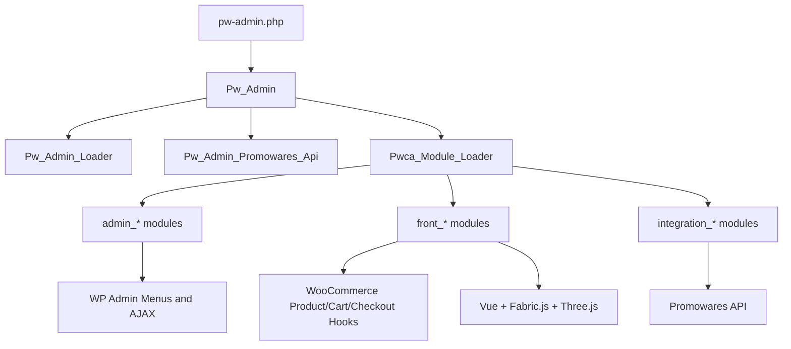

# 项目整体架构

## 1. 项目定位

`PW Canvas` 是一个 WordPress 插件，面向 WooCommerce 商品定制场景，核心能力包括：

- 产品页定制入口
- 独立画布设计页
- 定制商品购物车与结账流程
- 后台设计库管理
- 后台商品同步与缓存管理
- Promowares 外部 API 集成

项目运行方式是“插件被 WordPress 加载后，通过 Hook 和模块自举完成注册”，而不是传统的单体 Web 应用入口。

## 2. 顶层目录结构

```text
/workspace
├── pw-admin.php                  # 插件入口
├── includes/                     # 核心类
├── modules/                      # 业务模块
├── docs/                         # 开发文档
├── api_docs/                     # API 文档
├── woocommerce/                  # WooCommerce 模板覆盖
├── assets/                       # 插件公共静态资源
├── languages/                    # 国际化
└── uninstall.php                 # 卸载脚本
```

## 3. 启动链路

### 3.1 插件入口

入口文件是 `pw-admin.php`，主要完成以下工作：

1. 定义插件元信息与版本常量
2. 注册激活与停用钩子
3. 加载核心类 `Pw_Admin`
4. 实例化 `Pw_Admin` 并执行 `run()`

### 3.2 核心初始化

`includes/class-pw-admin.php` 中的 `Pw_Admin` 是总控类，构造阶段顺序如下：

1. `load_dependencies()`
2. `set_locale()`
3. `register_custom_post_types()`
4. `init_api_class()`
5. `load_modules()`
6. `define_admin_hooks()`

其中真正重要的三步是：

- `register_custom_post_types()`
  - 注册 `pw_design` 自定义文章类型
  - 注册 `pw_design_category`、`pw_design_tag`
- `init_api_class()`
  - 初始化 `Pw_Admin_Promowares_Api`
  - 提前注册聚合 API / REST 路由 / AJAX 能力
- `load_modules()`
  - 调用 `Pwca_Module_Loader` 扫描 `modules/*/index.php`

### 3.3 模块自举

每个模块都采用统一模式：

```text
modules/{module}/index.php
  -> require_once 主类
  -> 主类::bootstrap(__DIR__, plugin_dir_url(__FILE__))
  -> load_dependencies()
  -> register()
```

这让每个模块可以独立注册：

- WordPress Hook
- WooCommerce Hook
- REST Route
- AJAX 回调
- 页面资源

## 4. 架构分层

### 4.1 核心层

位于 `includes/`，负责插件级别能力：

- 核心控制器 `Pw_Admin`
- Hook 汇总器 `Pw_Admin_Loader`
- 模块扫描器 `Pwca_Module_Loader`
- Promowares API 代理 `Pw_Admin_Promowares_Api`
- 激活/停用/I18n 相关类

### 4.2 业务模块层

位于 `modules/`，按职责分三类：

- `admin_*`
  - 后台菜单、后台管理页、设计库、订单后台扩展
- `front_*`
  - 前台产品页、画布页、购物车、结账
- `integration_*`
  - Promowares 同步、Shipping 集成

### 4.3 前端应用层

主要集中在两个模块：

- `modules/front_product/`
  - 商品页 Vue 应用
- `modules/front_canvas/`
  - 设计器页 Vue + Pinia + Fabric.js + Three.js 应用

这一层不是通过集中式构建工具打包，而是由 PHP 通过 `wp_enqueue_script()` 直接装配本地脚本和 CDN 依赖。

## 5. 核心技术栈

### 5.1 后端

- PHP 5.6+
- WordPress Plugin API
- WooCommerce
- MySQL
- Action Scheduler

### 5.2 前端

- Vue 3
- Pinia
- VueUse
- Fabric.js
- Three.js
- jsPDF
- List.js
- layui

### 5.3 外部系统

- Promowares API
- Flamingo

## 6. 关键设计模式

### 6.1 Hook 驱动

插件核心不直接“执行业务”，而是：

- 在合适生命周期注册 Hook
- 由 WordPress / WooCommerce 事件驱动运行

这也是 `Pw_Admin_Loader` 存在的意义。

### 6.2 模块化自举

每个模块都以 `bootstrap()` 为起点，自行加载依赖并注册能力，降低了模块之间的硬编码耦合。

### 6.3 外部 API 统一代理

项目规则要求所有外部 API 调用统一通过 `includes/class-pw-admin-promowares-api.php` 处理，避免：

- 前端直连外部接口
- 暴露 token
- 各模块重复拼接请求逻辑

### 6.4 Canvas 实例与状态隔离

`modules/front_canvas/assets/js/canvas-manager.js` 使用 `CanvasManager` 将 Fabric 实例与 Vue 响应式系统隔离，避免大型画布对象进入响应式跟踪。

### 6.5 子模块 Loader

复杂后台模块内部又采用二级模块化：

- `admin_dashboard` 使用 `features/feat_*`
- `admin_orders` 使用 `features/feat_*`

这样将大模块拆成多个子功能域。

## 7. 核心关系图



## 8. 目录阅读建议

如果第一次接触仓库，推荐按下面顺序阅读：

1. `pw-admin.php`
2. `includes/class-pw-admin.php`
3. `includes/class-pw-admin-loader.php`
4. `includes/class-pwca-module-loader.php`
5. `includes/class-pw-admin-promowares-api.php`
6. `modules/front_product/`
7. `modules/front_canvas/`
8. `modules/front_cart/`
9. `modules/integration_promowares/`
10. `modules/integration_shipping/`

## 9. 架构结论

从架构角度看，这个项目的“主系统”不是后台页面，而是围绕 WooCommerce 商品定制建立的一条完整链路：

```text
商品页入口 -> 设计器/配置选择 -> 定制数据入车 -> 自定义购物车 -> 自定义结账 -> 后台订单处理/导出
```

后台模块和集成模块都是为了支撑这条主业务链路而存在。
