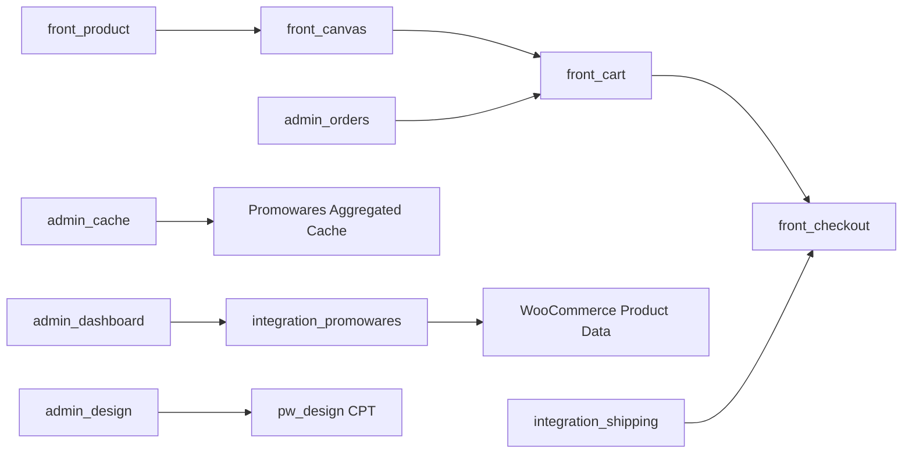

# 模块地图

## 1. 模块分类总览

`modules/` 目录下的模块按前缀分为三类：

| 模块类型 | 目录前缀 | 作用 |
| --- | --- | --- |
| 后台管理模块 | `admin_*` | 后台菜单、设置页、缓存管理、设计库、订单后台扩展 |
| 前台模块 | `front_*` | 产品页、设计器、购物车、结账流程 |
| 集成模块 | `integration_*` | 外部系统同步、物流/运费集成 |

## 2. 模块清单

| 模块 | 角色 | 主入口类 | 核心职责 |
| --- | --- | --- | --- |
| `admin_cache` | 后台 | `Pwca_Admin_Cache` | 管理聚合产品缓存、查看缓存状态、手动清理缓存 |
| `admin_dashboard` | 后台 | `Pwca_Admin_Dashboard` | Promoware 主后台入口，承载多个后台功能 tab |
| `admin_design` | 后台 | `Pwca_Admin_Design` | 管理 `pw_design` 设计资源、分类、标签、元数据 |
| `admin_orders` | 后台 | `Pwca_Admin_Orders` | 订单后台增强、生产 PDF、查看设计等 |
| `admin_woocommerce` | 后台 | `Pwca_Admin_WooCommerce` | WooCommerce 后台商品列表和显示行为调整 |
| `front_canvas` | 前台 | `Pwca_Front_Canvas` | 独立画布页、设计器资源、Inquiry REST |
| `front_cart` | 前台 | `Pwca_Front_Cart` | 定制商品加购、购物车展示、数量与折扣处理 |
| `front_checkout` | 前台 | `Pwca_Front_Checkout` | 自定义 checkout 资源、跳转和模板覆盖 |
| `front_product` | 前台 | `Pwca_Front_Product` | 商品页定制入口、Vue 挂载、价格/图片/按钮调整 |
| `integration_promowares` | 集成 | `Pwca_Integration_Promowares` | Promowares 商品同步、token 保存、导入调度 |
| `integration_shipping` | 集成 | `Pwca_Integration_Shipping` | 运费获取、运费写回 session、自定义 shipping method |

## 3. 后台模块

### 3.1 `admin_cache`

#### 关键文件

- `modules/admin_cache/index.php`
- `modules/admin_cache/includes/class-pwca-admin-cache.php`
- `modules/admin_cache/views/main-page.php`

#### 主要职责

- 提供后台缓存管理页
- 通过 AJAX 查询缓存状态
- 手动清空产品缓存
- 依赖 `Pw_Admin_Promowares_Api` 的缓存能力

#### 典型入口

- `handle_clear_product_cache()`
- `handle_get_cache_status()`

### 3.2 `admin_dashboard`

#### 关键文件

- `modules/admin_dashboard/includes/class-pwca-admin-dashboard.php`
- `modules/admin_dashboard/includes/class-pwca-admin-dashboard-loader.php`
- `modules/admin_dashboard/features/feat_*/`

#### 主要职责

- 注册后台顶级菜单 `pw-dashboard`
- 注册子菜单 `pw-dashboard-settings`
- 作为后台功能聚合容器
- 使用二级 Loader 自动加载 `features/feat_*`

#### 子功能

| 子模块 | 类 | 作用 |
| --- | --- | --- |
| `feat_dashboard` | `Pwca_Admin_Dashboard_Dashboard` | 仪表板主页、同步按钮、绑定店铺等 |
| `feat_settings` | `Pwca_Admin_Dashboard_Settings` | token、API 参数、自定义文本颜色等设置 |
| `feat_status` | `Pwca_Admin_Dashboard_Status` | 状态信息展示 |
| `feat_product_request` | `Pwca_Admin_Dashboard_Product_Request` | 产品请求提交流程 |
| `feat_support` | `Pwca_Admin_Dashboard_Support` | 支持相关页面 |

### 3.3 `admin_design`

#### 关键文件

- `modules/admin_design/includes/class-pwca-admin-design.php`
- `modules/admin_design/views/design-library.php`

#### 主要职责

- 设计库后台管理
- 分类与标签操作
- 设计资源元数据编辑
- 批量更新、批量删除
- 设计 SKU 唯一性校验

#### 特点

- 这是一个“胖类”模块，单文件承载了大量后台管理逻辑
- AJAX 入口多，适合后续逐步拆分

### 3.4 `admin_orders`

#### 关键文件

- `modules/admin_orders/includes/class-pwca-admin-orders.php`
- `modules/admin_orders/includes/class-pwca-admin-orders-loader.php`
- `modules/admin_orders/features/feat_*/`

#### 主要职责

- 只在订单后台 screen 生效
- 提供订单元信息、设计查看、生产 PDF 相关功能
- 使用二级 Loader 加载订单子功能

#### 子功能

| 子模块 | 类 | 作用 |
| --- | --- | --- |
| `feat_order_meta` | `Pwca_Admin_Orders_Order_Meta` | 扩展订单元数据展示 |
| `feat_view_design` | `Pwca_Admin_Orders_View_Design` | 后台查看设计图 |
| `feat_production_pdf` | `Pwca_Admin_Orders_Production_Pdf` | 生产 PDF 相关操作 |

### 3.5 `admin_woocommerce`

#### 关键文件

- `modules/admin_woocommerce/includes/class-pwca-admin-woocommerce.php`

#### 主要职责

- WooCommerce 后台列表行为增强
- 同步商品标识处理
- 复合商品/组合商品显示控制
- 列表列、操作按钮、查询行为调整

## 4. 前台模块

### 4.1 `front_product`

#### 关键文件

- `modules/front_product/includes/class-pwca-front-product.php`
- `modules/front_product/includes/class-pwca-front-product-assets.php`
- `modules/front_product/includes/class-pwca-front-product-mount.php`
- `modules/front_product/includes/class-pwca-front-product-woo-adjustments.php`
- `modules/front_product/assets/js/product/main.js`

#### 主要职责

- 在商品页挂载 Vue 应用
- 装配产品页定制相关前端资源
- 隐藏同步商品默认价格与默认加购按钮
- 注入颜色、数量、配件、价格、定制按钮等 UI
- 添加产品 Inquiry tab

#### 关键边界

- 只在商品上下文中工作
- 仅对同步商品 `pw_isSyncProduct=1` 激活定制 UI
- 直接复用 `front_canvas` 的 `canvas-manager.js`

### 4.2 `front_canvas`

#### 关键文件

- `modules/front_canvas/includes/class-pwca-front-canvas.php`
- `modules/front_canvas/includes/class-pwca-front-canvas-router.php`
- `modules/front_canvas/includes/class-pwca-front-canvas-assets.php`
- `modules/front_canvas/includes/class-pwca-front-canvas-inquiry-rest.php`
- `modules/front_canvas/assets/js/canvas/page-bootstrap.js`
- `modules/front_canvas/assets/js/design/main.js`

#### 主要职责

- 注册 `/pwcanvas` 独立路由
- 输出设计器页面模板
- 按画布页面上下文加载 Vue/Pinia/Fabric/Three 等资源
- 提供画布 Inquiry REST 接口
- 管理设计器的多视图、图层、操作面板、导出与状态恢复

#### 关键特点

- `script_loader_tag` 会将部分脚本改为 `type="module"`
- 前端资源依赖链很长，几乎构成一个前端应用运行时
- 复用 `front_product` 中的渐变弹窗样式与脚本

### 4.3 `front_cart`

#### 关键文件

- `modules/front_cart/includes/class-pwca-front-cart.php`
- `modules/front_cart/includes/class-pwca-front-cart-handler.php`
- `modules/front_cart/includes/class-pwca-front-cart-design-column.php`
- `modules/front_cart/includes/class-pwca-front-cart-quantity.php`

#### 主要职责

- 接收定制商品加购 AJAX
- 存储前端生成的定制图片
- 将定制数据写入 cart item data
- 处理定制商品与空白商品互斥规则
- 自定义购物车显示、数量逻辑、折扣计算

#### 关键边界

- 深度依赖 WooCommerce Cart 与 Session
- 负责“定制商品如何安全入车”
- 业务链中最关键的订单前置模块之一

### 4.4 `front_checkout`

#### 关键文件

- `modules/front_checkout/includes/class-pwca-front-checkout.php`
- `modules/front_checkout/includes/class-pwca-front-checkout-assets.php`
- `modules/front_checkout/includes/class-pwca-front-checkout-template-override.php`
- `modules/front_checkout/includes/class-pwca-front-checkout-redirect.php`

#### 主要职责

- 定义自定义 checkout 资源加载规则
- 管理跳转逻辑
- 覆盖 WooCommerce checkout 模板

#### 典型场景

- 插件使用自己的 `woocommerce/checkout/review-order.php`
- 与 shipping 集成模块配合完成结账体验

## 5. 集成模块

### 5.1 `integration_promowares`

#### 关键文件

- `modules/integration_promowares/includes/class-pwca-integration-promowares.php`

#### 主要职责

- 保存 token 与 mock mode
- 获取远程商品列表
- 创建 WooCommerce 产品
- 处理单品与组合商品同步
- 使用 Action Scheduler 执行批量导入任务

#### 关键特点

- 负责“远程产品如何进入本地 WooCommerce”
- 与 `Pw_Admin_Promowares_Api` 强耦合
- 是后台商品同步的核心执行层

### 5.2 `integration_shipping`

#### 关键文件

- `modules/integration_shipping/includes/class-pwca-integration-shipping.php`
- `modules/integration_shipping/includes/class-pwca-integration-shipping-shipping.php`
- `modules/integration_shipping/includes/class-pwca-integration-shipping-shipping-ajax.php`
- `modules/integration_shipping/includes/class-wc-pwca-shipping-method.php`

#### 主要职责

- 提供 checkout 运费选择逻辑
- 调用 `Pw_Admin_Promowares_Api::calculate_shipping_options()`
- 将选中的运费写入 WooCommerce Session
- 注册自定义 shipping method

## 6. 模块间依赖关系

## 6.1 强依赖

- `front_product` -> `front_canvas`
  - 复用 `canvas-manager.js`
- `front_canvas` -> `front_product`
  - 复用 `gradient-modal.js` 与 `pw-gradient-modal.css`
- `integration_promowares` -> `Pw_Admin_Promowares_Api`
- `integration_shipping` -> `Pw_Admin_Promowares_Api`
- `admin_cache` -> `Pw_Admin_Promowares_Api`

## 6.2 公共底座依赖

几乎所有模块都依赖下列能力之一：

- WordPress Hook
- WooCommerce
- `Pw_Admin_Promowares_Api`
- WordPress options / post meta

## 7. 模块关系图

## 8. 优先理解的模块

如果是为了理解业务主线，优先顺序建议如下：

1. `front_product`
2. `front_canvas`
3. `front_cart`
4. `front_checkout`
5. `integration_shipping`
6. `integration_promowares`

如果是为了理解后台管理链路，优先顺序建议如下：

1. `admin_dashboard`
2. `integration_promowares`
3. `admin_cache`
4. `admin_orders`
5. `admin_design`

## 9. 模块设计结论

这个仓库的模块划分整体清晰，但存在两个值得注意的结构特点：

- 后台和前台都采用“主模块 + 多个辅助类”的组织方式
- 少量跨模块前端资源复用已经出现，后续如果继续增长，建议抽出真正的公共模块或公共资源层
