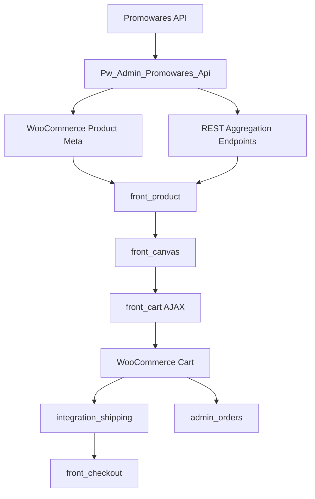

# 数据流与接口

## 1. 主业务链路

这个项目最重要的业务主线是：

```text
Promowares 商品同步
  -> WooCommerce 商品页
  -> 产品页定制入口
  -> /pwcanvas 设计器页面
  -> 定制数据写入购物车
  -> 自定义购物车
  -> 结账页运费与校验
  -> 后台订单查看 / PDF / 设计查看
```

## 2. 商品同步数据流

### 2.1 入口

后台从 `admin_dashboard` 发起同步请求，最终进入：

- `Pwca_Integration_Promowares::schedule_product_import()`
- `Pwca_Integration_Promowares::schedule_product_import_internal()`

### 2.2 执行过程

1. 检查权限与 Action Scheduler 可用性
2. 清理旧的导入任务与旧同步商品
3. 调用 `Pw_Admin_Promowares_Api`
   - `get_products_from_api()`
   - `get_composite_products_from_api()`
4. 为普通产品创建 `import_single_product` 任务
5. 为组合商品创建 `import_composite_product_group` 任务
6. 异步导入 WooCommerce 产品、图片、meta、模板信息

### 2.3 结果

同步后的 WooCommerce 商品会携带多种自定义 meta，例如：

- `pw_isSyncProduct`
- 组合商品主从关系相关 meta
- 模板/颜色/定制相关 meta

这些 meta 之后会被商品页、购物车、后台列表继续消费。

## 3. 产品页数据流

### 3.1 页面入口

在 WooCommerce 单品页中，`front_product` 模块启动：

- `Pwca_Front_Product_Assets::enqueue_assets()`
- `Pwca_Front_Product_Mount::register()`
- `Pwca_Front_Product_Woo_Adjustments::register()`

### 3.2 视图装配

商品页会注入 Vue 挂载点，并通过 `main.js` 启动前端应用。

前端读取的关键信息包括：

- 产品 ID
- `pwId`
- REST API URL
- REST nonce

### 3.3 产品数据请求

产品页前端脚本会经由本地 API 封装脚本访问内部接口，而不是直连外部 Promowares API。

核心思路是：

1. 请求 WordPress 内部 REST / 聚合接口
2. 后端再由 `Pw_Admin_Promowares_Api` 调用外部接口或缓存
3. 返回适合前端直接消费的聚合结果

## 4. 设计器数据流

### 4.1 设计器页面进入方式

设计器由 `Pwca_Front_Canvas_Router` 注册：

- 路由: `/pwcanvas`
- query var: `pw_canvas`

请求命中后，输出：

- `modules/front_canvas/views/canvas-page.php`

### 4.2 设计器前端资源装配

`Pwca_Front_Canvas_Assets::enqueue_assets()` 会加载：

- Vue / Pinia / VueUse
- Fabric.js
- jsPDF
- List.js
- 本地画布脚本
- 本地设计器模块脚本

### 4.3 画布状态

设计器使用 `CanvasManager` 管理多视图画布状态：

- 当前画布实例
- 视图切换
- 导出图片
- 画布序列化
- 状态恢复

这使得“多视图设计”和“状态持久化恢复”成为可能。

## 5. 购物车数据流

### 5.1 加购入口

定制商品通过 AJAX 加购：

- `wp_ajax_add_customized_product_to_cart`
- `wp_ajax_nopriv_add_customized_product_to_cart`

处理函数：

- `Pwca_Front_Cart_Handler::add_customized_product_to_cart()`

### 5.2 加购处理步骤

1. 校验 nonce
2. 校验产品有效性与库存
3. 处理 grouped product 到实际子产品的映射
4. 检查购物车是否允许与当前商品混合
5. 接收前端生成的图片数据
6. 将图片保存到上传目录
7. 构建 `cart_item_data`
8. 调用 `WC()->cart->add_to_cart()`

### 5.3 购物车业务规则

`Pwca_Front_Cart_Handler` 负责多项关键规则：

- 定制商品与普通商品不能混合结账
- 遇到同步商品时跳转自定义购物车 `/custom-cart/`
- 自定义图片要在购物车、订单项中正确显示
- 定制商品价格、折扣、小计、总价会被重新计算

## 6. 结账与运费数据流

### 6.1 运费选项获取

前端通过 AJAX 请求：

- `pwca_get_shipping_options`

后端处理：

- `Pwca_Integration_Shipping_Shipping_Ajax::get_shipping_options()`

内部调用：

- `Pw_Admin_Promowares_Api::calculate_shipping_options($country_code, $weight, 'PK1792')`

### 6.2 运费选择写回

用户选择运费后，请求：

- `pwca_update_shipping_cost`

后端会把以下值写入 WooCommerce Session：

- `pwca_selected_shipping_cost`
- `pwca_selected_shipping_service`

然后触发重新计算购物车总价。

### 6.3 运费清空

对应 AJAX：

- `pwca_clear_shipping_selection`

## 7. 后台订单数据流

订单进入后台后，`admin_orders` 模块介入：

- 判断当前是否为订单后台 screen
- 加载订单扩展样式
- 自动加载订单功能子模块

典型功能包括：

- 显示订单设计信息
- 查看设计稿
- 生产 PDF

## 8. REST API 清单

### 8.1 通用 REST

| 路由 | 方法 | 作用 |
| --- | --- | --- |
| `/wp-json/pw/v1/getPwDesignImages` | GET | 获取 `pw_design` 的封面图片列表 |

### 8.2 聚合与设计器 REST

| 路由 | 方法 | 作用 |
| --- | --- | --- |
| `/wp-json/pw/v1/product-data/{id}` | GET | 获取聚合产品数据 |
| `/wp-json/pw-canvas/v1/store-customization-settings` | GET | 获取店铺级定制设置 |
| `/wp-json/pw-canvas/v1/print-methods` | POST | 获取印刷方式数据 |
| `/wp-json/pw-canvas/v1/custom-colors` | POST | 获取自定义颜色数据 |
| `/wp-json/pw-canvas/v1/upload-image` | POST | 上传图片 |
| `/wp-json/pwca/v1/inquiry` | POST | 提交画布询盘 |

## 9. AJAX 入口清单

### 9.1 前台

| AJAX | 处理位置 | 用途 |
| --- | --- | --- |
| `add_customized_product_to_cart` | `front_cart` | 定制商品入车 |
| `pw_has_blank_in_cart` | `front_cart` | 查询购物车是否有 blank item |
| `pw_cart_blank_state` | `front_cart` | 查询购物车 blank / non-blank 状态 |
| `pw_get_cart_canvas_state` | `front_cart` | 读取购物车中的画布状态 |
| `pwca_update_cart_quantity` | `front_cart` | 更新购物车数量 |
| `pw_duplicate_cart_item` | `front_cart` | 复制购物车项 |
| `pwca_get_shipping_options` | `integration_shipping` | 获取运费方案 |
| `pwca_update_shipping_cost` | `integration_shipping` | 更新已选运费 |
| `pwca_clear_shipping_selection` | `integration_shipping` | 清空运费选择 |

### 9.2 后台

| AJAX | 处理位置 | 用途 |
| --- | --- | --- |
| `pwca_sync_products` | `admin_dashboard/feat_dashboard` | 发起商品同步 |
| `pwca_get_bind_entry_url` | `admin_dashboard/feat_dashboard` | 获取绑定入口 |
| `pwca_disconnect_store` | `admin_dashboard/feat_dashboard` | 断开店铺绑定 |
| `check_import_progress` | `integration_promowares` | 查询同步进度 |
| `pw_save_token` | `integration_promowares` | 保存 token |
| `pw_save_mock_mode` | `integration_promowares` | 保存 mock mode |
| `pw_clear_product_cache` | `admin_cache` | 清理缓存 |
| `pw_get_cache_status` | `admin_cache` | 查询缓存状态 |
| `pw_add_category` 等 | `admin_design` | 设计库管理操作 |

## 10. Action Scheduler 异步任务

`integration_promowares` 依赖 Action Scheduler 处理批量同步，核心任务包括：

| Hook 名称 | 作用 |
| --- | --- |
| `import_single_product` | 导入单个普通产品 |
| `import_composite_product_group` | 导入组合商品组 |
| `process_container_rules` | 异步应用容器规则 |

这说明同步流程是“后台触发 + 队列异步执行”的模式，而不是一次请求内全量完成。

## 11. 缓存策略

缓存核心位于 `Pw_Admin_Promowares_Api`，主要目标是避免每次都请求 Promowares 接口。

### 11.1 缓存对象

- 聚合产品数据
- 产品变更检查结果
- 印刷方式
- 自定义颜色

### 11.2 典型方法

- `get_cached_product_data()`
- `save_cached_product_data()`
- `clear_cached_product_data()`
- `clear_all_cached_product_data()`
- `check_remote_data_freshness()`
- `check_product_data_changes()`

### 11.3 配套后台能力

`admin_cache` 提供了人工清理与状态查看入口。

## 12. 外部 API 代理原则

本仓库遵循统一原则：

- 前端不能直连 Promowares API
- token 不能暴露到前端
- 外部请求统一通过 `Pw_Admin_Promowares_Api`
- 对前端优先暴露内部 REST / 聚合接口

## 13. 数据流结论

如果只抓最重要的几个节点，可以把整个系统理解成下面这张图：


